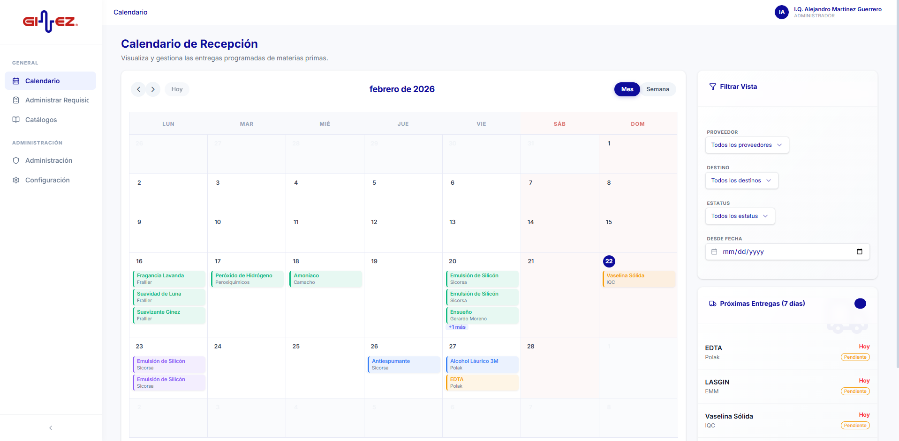

# 📦 GINEZ Calendario y Gestión de Requisiciones de Compras de MP

Sistema empresarial avanzado para el control, seguimiento y gestión integral de requisiciones de materias primas, suministros y entregas logísticas.



## 🎯 Propósito del Sistema
Optimizar el flujo de suministros de **GínEZ**, permitiendo una comunicación fluida entre los departamentos de Compras, Laboratorio, CEDIS y los proveedores externos, garantizando que cada insumo llegue en el tiempo y forma solicitados.

---

## 🚀 Módulos y Características

### 1. 📋 Gestión de Requisiciones
Centro de control operativo para el ciclo de vida de los insumos:
- **Seguimiento Multipaso**: Control desde la recepción de la solicitud hasta la entrega física.
- **Trazabilidad de Fechas**: Diferenciación clara entre *Fecha Solicitada*, *Fecha Confirmada* (proveedor) y *Fecha Real de Entrega*.
- **Filtros Inteligentes**: Segmentación por proveedor, destino, estatus operativo y rangos temporales.
- **Acciones Rápidas**: Edición ágil y gestión de estatus con un solo clic.

### 2. 📅 Calendario de Suministros (Logística)
Visualización temporal dinámica basada en FullCalendar:
- **Vista Semanal/Mensual**: Monitoreo visual de la carga de trabajo en recepción.
- **Estatus por Colores**: Identificación inmediata de entregas pendientes, urgentes, confirmadas o completadas.
- **Gestión Directa**: Arrastrar y soltar o clic para ver detalles y ajustar programaciones.

### 3. 📂 Catálogos Maestros (Data Management)
Estandarización de información crítica para evitar errores de captura:
- **Proveedores**: Directorio unificado de empresas suministradoras.
- **Productos**: Inventario maestro de materias primas y suministros.
- **Presentaciones**: Tipos de envase, empaque y unidades de carga.
- **Unidades de Medida**: Estandarización de pesos y volúmenes (kg, L, piezas, etc.).
- **Destinos y Plantas**: Gestión de puntos de recepción (Plantas GínEZ, CEDIS).

### 4. 🔐 Seguridad y Control de Acceso
Sistema basado en roles con jerarquías claras:
- **Admin**: Gestión de usuarios, perfiles, catálogos y auditoría total.
- **Coordinadora**: Operación de requisiciones y acuerdos con proveedores.
- **Laboratorio**: Validación técnica y monitoreo de llegadas.
- **CEDIS**: Confirmación de recepción e inventario entrante.
- **Flujo de Registro**: Sistema de aprobación por administrador para nuevos usuarios.

---

## 🛠️ Stack Tecnológico

| Tecnología | Descripción |
| :--- | :--- |
| **Framework** | [Next.js 15+](https://nextjs.org/) (React 19, Server Actions) |
| **Backend / DB** | [Supabase](https://supabase.com/) (PostgreSQL + Realtime) |
| **Autenticación** | Supabase Auth (Manejo de sesiones y roles) |
| **Estilos** | [Tailwind CSS 4](https://tailwindcss.com/) (Modern CSS engine) |
| **Componentes UI** | [Shadcn UI](https://ui.shadcn.com/) (Radix UI) |
| **Formularios** | React Hook Form + Zod |
| **Tabla de Datos** | TanStack Table (v8) |
| **Calendario** | FullCalendar v6 |

---

## 💻 Desarrollo y Configuración

### Prerrequisitos
- Node.js 18.x o superior
- Cuenta en Supabase

### Pasos para iniciar
1. **Clonar el proyecto**:
   ```bash
   git clone https://github.com/AlejandroMartinezG/App_Compras.git
   cd App_Compras
   ```

2. **Instalar dependencias**:
   ```bash
   npm install
   ```

3. **Variables de Entorno**:
   Crea un archivo `.env.local` en la raíz con las siguientes claves:
   ```env
   NEXT_PUBLIC_SUPABASE_URL=tu_url_de_supabase
   NEXT_PUBLIC_SUPABASE_ANON_KEY=tu_anon_key
   ```

4. **Ejecutar en desarrollo**:
   ```bash
   npm run dev
   ```

---

## 🏗️ Estructura del Proyecto
- `/app`: Rutas del sistema (Dashboard, Admin, Requisiciones).
- `/components`: Componentes reutilizables (UI, Formularios, Calendario).
- `/lib`: Lógica de negocio, hooks personalizados y acciones de Supabase.
- `/types`: Definiciones de interfaces y tipos TypeScript.
- `/supabase`: Configuraciones y esquemas de base de datos.

---
© 2026 **GínEZ** - Calidad y Desarrollo.
