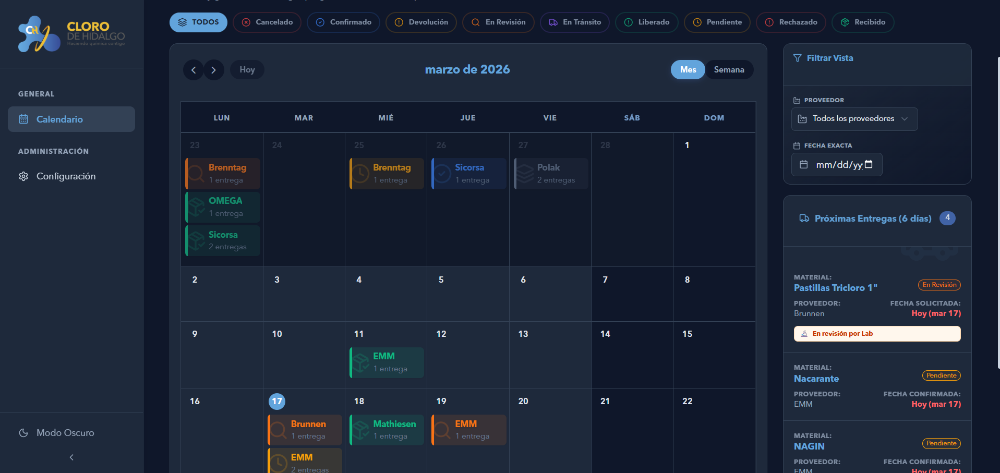
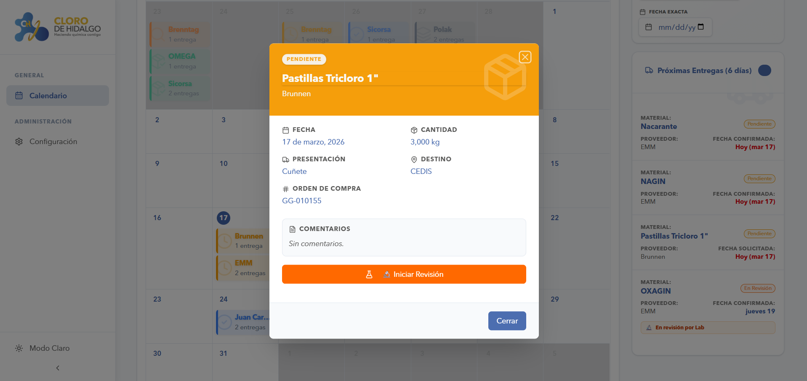
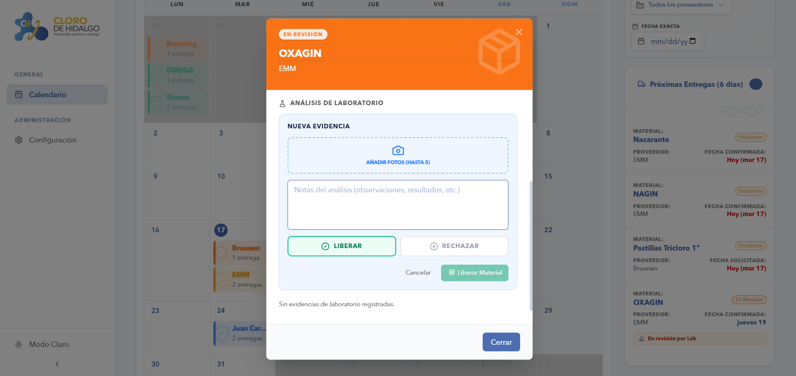
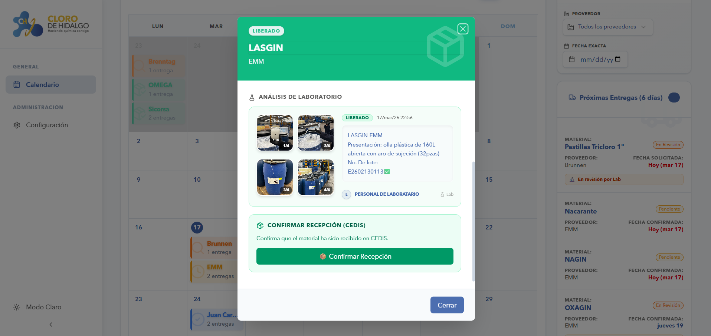

# 📦 Purchase Tracking — Cloro de Hidalgo
## Calendario y Gestión de Requisiciones de Compras de MP

<p align="center">
  
</p>

Sistema empresarial avanzado para el **control, seguimiento y gestión integral de requisiciones** de materias primas, suministros y entregas logísticas de **Cloro de Hidalgo**. Conecta los departamentos de **Compras, Laboratorio, CEDIS y Proveedores** en un solo flujo digital.

---

## 📸 Vista General del Sistema

### 🔐 Pantalla de Acceso


### 📅 Calendario de Recepción (Modo Claro)


### 🌙 Calendario de Recepción (Modo Oscuro)


---

## 🎯 Propósito del Sistema
Optimizar el flujo de suministros de **Cloro de Hidalgo**, permitiendo una comunicación fluida entre los departamentos de Compras, Laboratorio, CEDIS y los proveedores externos, garantizando que cada insumo llegue en el tiempo y forma solicitados, con **trazabilidad completa** desde la solicitud hasta la recepción física.

---

## 🚀 Módulos y Características

### 1. 📋 Gestión de Requisiciones
Centro de control operativo para el ciclo de vida completo de los insumos:
- **Seguimiento Multipaso**: Control desde la solicitud hasta la entrega física, con flujo de estatus dinámico.
- **Trazabilidad de Fechas**: Diferenciación clara entre *Fecha Solicitada*, *Fecha Confirmada* (proveedor), *Fecha OC* y *Fecha Real de Entrega*.
- **Filtros Inteligentes**: Segmentación por proveedor, destino, estatus operativo y rangos temporales.
- **Acciones Rápidas**: Edición ágil y gestión de estatus con un solo clic.
- **Número de Requisición y OC**: Registro y rastreo de folios de requisición y órdenes de compra.
- **Factura/Remisión**: Campo para documentar la factura o remisión de cada entrega.

### 2. 📅 Calendario de Suministros (Logística)
Visualización temporal dinámica basada en FullCalendar:
- **Vista Semanal/Mensual**: Monitoreo visual de la carga de trabajo en recepción.
- **Estatus por Colores**: Identificación inmediata de entregas pendientes, urgentes, confirmadas, en tránsito o completadas.
- **Gestión Directa**: Clic para ver detalles completos del material, editar o cambiar estatus.
- **Agrupación por Proveedor**: Modal dedicado para ver todas las entregas de un mismo proveedor en un día.
- **Panel Lateral de Próximas Entregas**: Vista rápida de las entregas programadas en los próximos días.
- **Badge de Estatus en Modal**: Al abrir el detalle de una requisición, se muestra el nombre del estatus de forma visual y clara junto al icono y color correspondiente.

### 3. 🔬 Módulo de Laboratorio
Flujo completo de inspección y análisis de calidad:

#### Iniciar Revisión
El personal de laboratorio puede iniciar la revisión de un material directamente desde el calendario:


#### Subida de Evidencia Fotográfica
Hasta **5 fotos por registro** de análisis, con campo de notas y selección de dictamen:


#### Galería de Análisis Completado
Las fotos del análisis se muestran en una cuadrícula visual con notas del analista y resultado del dictamen:


**Características del módulo:**
- **Notas de Análisis**: Campo de texto libre para observaciones, resultados y detalles técnicos, **respetando los saltos de línea** para mantener el formato del reporte.
- **Dictamen de Material**: Decisión de **Liberar** ✅ o **Rechazar** ❌ el material, actualizando automáticamente el estatus de la requisición.
- **Galería tipo Masonry**: Las fotos se muestran en cuadrícula inteligente con indicadores de posición (1/4, 2/4, etc.) y ampliación al hacer clic.
- **Firma del Analista**: Cada registro muestra quién realizó el análisis, con avatar, nombre completo y etiqueta de departamento.
- **Historial de Evidencias**: Se mantiene el registro completo de todas las evidencias subidas para cada requisición.

### 4. 📦 Módulo CEDIS (Centro de Distribución)
Gestión de la recepción y devolución de materiales:



- **Confirmación de Recepción**: CEDIS puede confirmar que el material fue recibido físicamente.
- **Devolución a Proveedor**: Cuando un material es rechazado por laboratorio, CEDIS gestiona la devolución.
- **Flujo Configurable por Producto**: Los productos se configuran como *"requiere inspección"* o *"no requiere inspección"*:
  - **Con inspección**: Sigue el flujo completo → Laboratorio revisa → Libera/Rechaza → CEDIS recibe o devuelve.
  - **Sin inspección**: CEDIS puede confirmar la recepción directamente desde los estatus Pendiente, Confirmado o En Tránsito, **sin pasar por Lab**.

### 5. 📂 Catálogos Maestros (Data Management)
Estandarización de información crítica para evitar errores de captura:
- **Proveedores**: Directorio unificado de empresas suministradoras con estado activo/inactivo.
- **Productos**: Inventario maestro de materias primas y suministros, con campo de **Requiere Inspección** configurable.
- **Relación Producto-Proveedor**: Asignación de qué proveedores surten cada producto mediante checkboxes.
- **Presentaciones**: Tipos de envase, empaque y unidades de carga.
- **Unidades de Medida**: Estandarización de pesos y volúmenes (kg, L, piezas, etc.).
- **Destinos y Plantas**: Gestión de puntos de recepción (Plantas Cloro de Hidalgo, CEDIS).
- **Estatus**: Catálogo de estatus con colores hexadecimales personalizables.
- **Edición Inline**: Todos los catálogos permiten agregar, editar y activar/desactivar registros desde un modal rápido.

### 6. 🔐 Seguridad y Control de Acceso
Sistema basado en roles con jerarquías claras:
- **Admin**: Gestión de usuarios, perfiles, catálogos y auditoría total.
- **Coordinadora de Compras**: Operación de requisiciones, programación y acuerdos con proveedores.
- **Laboratorio**: Inspección de materiales, subida de evidencia fotográfica y dictamen de liberación/rechazo.
- **CEDIS**: Confirmación de recepción física de materiales y gestión de devoluciones.
- **Consulta**: Acceso de solo lectura para visualizar información sin modificar datos.
- **Flujo de Registro**: Sistema de aprobación por administrador para nuevos usuarios con estatus "pendiente".

### 7. 🌙 Modo Oscuro
Interfaz completamente adaptada para ambientes con poca luz:
- **Tema adaptativo**: Todos los componentes, modales, formularios y tarjetas se adaptan automáticamente al tema claro u oscuro.
- **Variables CSS**: Sistema de colores basado en variables CSS (`--navy`, `--foreground`, `--card`, etc.) que se intercambian dinámicamente.
- **Contraste optimizado**: Títulos, etiquetas, badges y fondos diseñados para garantizar legibilidad en ambos temas.

---

## 🔄 Flujo de Estatus de una Requisición

```
┌──────────┐    ┌────────────┐    ┌─────────────┐    ┌────────────┐    ┌──────────┐    ┌──────────┐
│ Pendiente│───▶│ Confirmado │───▶│ En Tránsito │───▶│ En Revisión│───▶│ Liberado │───▶│ Recibido │
└──────────┘    └────────────┘    └─────────────┘    │  (Lab)     │    └──────────┘    └──────────┘
                                                     └──────┬─────┘
                                                            │
                                                     ┌──────▼─────┐    ┌────────────┐
                                                     │ Rechazado  │───▶│ Devolución │
                                                     └────────────┘    └────────────┘
```

> **Nota**: Los productos marcados como *"No requiere inspección"* saltan del flujo de Pendiente/Confirmado/En Tránsito directamente a Recibido, sin pasar por Laboratorio.

---

## 🛠️ Stack Tecnológico

| Tecnología | Descripción |
| :--- | :--- |
| **Framework** | [Next.js 15+](https://nextjs.org/) (React 19, Server Actions) |
| **Backend / DB** | [Supabase](https://supabase.com/) (PostgreSQL + Storage + Realtime) |
| **Autenticación** | Supabase Auth (Manejo de sesiones y roles) |
| **Almacenamiento** | Supabase Storage (Fotos de evidencia de laboratorio) |
| **Estilos** | [Tailwind CSS 4](https://tailwindcss.com/) (Modern CSS engine) |
| **Tipografía** | Avenir Next LT Pro (Fuentes Corporativas) |
| **Componentes UI** | [Shadcn UI](https://ui.shadcn.com/) (Radix UI) |
| **Formularios** | React Hook Form + Zod (Validación de esquemas) |
| **Tabla de Datos** | TanStack Table (v8) |
| **Calendario** | FullCalendar v6 |
| **Notificaciones** | Sonner (Toast notifications) |
| **Iconos** | Lucide React |

---

## 💻 Desarrollo y Configuración

### Prerrequisitos
- Node.js 18.x o superior
- Cuenta en Supabase

### Pasos para iniciar
1. **Clonar el proyecto**:
   ```bash
   git clone https://github.com/AlejandroMartinezG/App_Compras.git
   cd App_Compras
   ```

2. **Instalar dependencias**:
   ```bash
   npm install
   ```

3. **Variables de Entorno**:
   Crea un archivo `.env.local` en la raíz con las siguientes claves:
   ```env
   NEXT_PUBLIC_SUPABASE_URL=tu_url_de_supabase
   NEXT_PUBLIC_SUPABASE_ANON_KEY=tu_anon_key
   ```

4. **Ejecutar en desarrollo**:
   ```bash
   npm run dev
   ```

---

## 🏗️ Estructura del Proyecto
```
App_Compras/
├── app/                        # Rutas del sistema (Next.js App Router)
│   ├── (auth)/login/           # Página de inicio de sesión
│   ├── dashboard/              # Panel principal
│   │   ├── calendar/           # Calendario de entregas
│   │   ├── requisiciones/      # Tabla de requisiciones
│   │   ├── catalogos/          # Gestión de catálogos maestros
│   │   ├── admin/              # Panel de administración de usuarios
│   │   └── configuracion/      # Configuración del perfil
│   └── globals.css             # Variables CSS y tema global
├── components/                 # Componentes reutilizables
│   ├── calendar/               # CalendarView, EventModal, GroupedEventModal
│   ├── forms/                  # RequisicionForm, LabEvidenciaSection, CedisRecepcionForm, QuickAddModal
│   ├── layout/                 # Sidebar, Header
│   └── ui/                     # Componentes Shadcn (Button, Dialog, Badge, etc.)
├── lib/                        # Lógica de negocio
│   ├── actions/                # Server Actions (requisiciones, catalogos, laboratorio, cedis, auth)
│   ├── hooks/                  # Hooks personalizados (useAuthRole, useCatalogos)
│   └── supabase/               # Cliente de Supabase (client/server)
├── types/                      # Definiciones TypeScript
├── public/                     # Activos estáticos, logos y fuentes corporativas
└── supabase/                   # Configuraciones y migraciones de base de datos
```

---

## 📊 Modelo de Datos

| Tabla | Descripción |
| :--- | :--- |
| `requisiciones` | Registro principal de cada requisición con fechas, cantidades, folios y relaciones |
| `proveedores` | Catálogo de proveedores |
| `productos` | Catálogo de productos con campo `requiere_inspeccion` |
| `producto_proveedor` | Relación N:M entre productos y proveedores |
| `presentaciones` | Tipos de presentación del material |
| `unidades` | Unidades de medida |
| `destinos` | Puntos de entrega |
| `estatus` | Catálogo de estatus con colores personalizables |
| `profiles` | Perfiles de usuario con roles |
| `lab_evidencias` | Evidencias de laboratorio con fotos múltiples (`fotos[]`), notas y resultado |
| `requisiciones_historial` | Auditoría de cambios en requisiciones |

---

© 2026 **Cloro de Hidalgo S.A. de C.V.** — Calidad y Desarrollo.
